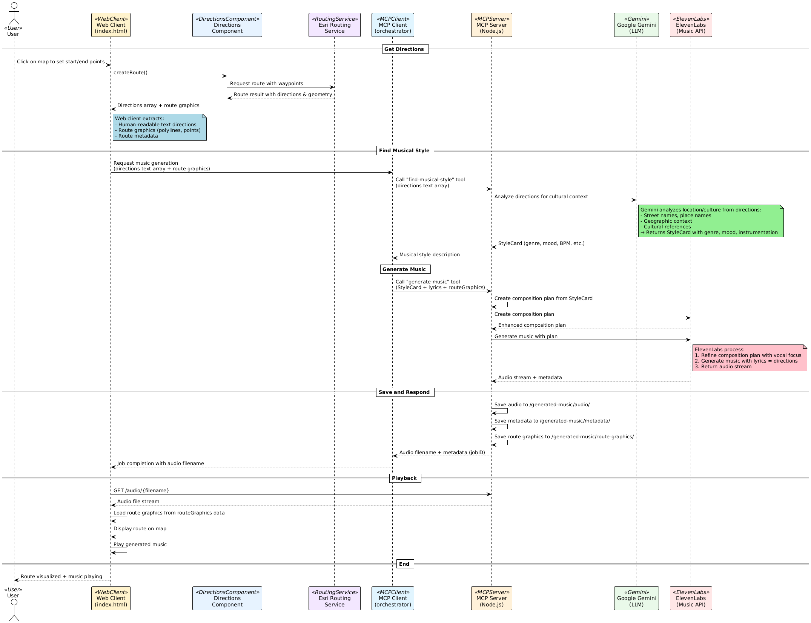

# Directions2Music

Convert routing directions into musical compositions using AI-powered style detection and music generation.

## Overview

This project transforms GPS routing directions into personalized music by:
1. **Analyzing directions** to infer musical style based on cultural and geographical context
2. **Generating music** using ElevenLabs AI that matches the journey's character
3. **Serving audio files** via a web-friendly API for playback

## Architecture

 

```
┌─────────────────┐    ┌─────────────────┐    ┌─────────────────┐
│   WebClient     │    │  Client Express │    │   MCP Server    │
│  (Frontend)     │◄──►│   (Port 3001)   │◄──►│  (Port 3000)    │
│                 │    │                 │    │                 │
│ • User Input    │    │ • Orchestration │    │ • AI Processing │
│ • Audio Playback│    │ • File Serving  │    │ • Music Gen     │
└─────────────────┘    └─────────────────┘    └─────────────────┘
```

## Prerequisites

### 1. API Keys Setup

The system requires API keys for:
- **Google Gemini AI** (for style detection)
- **ElevenLabs** (for music generation)

#### Configure API Keys:

```bash
# Navigate to MCP server directory
cd MCP/server

# Copy the template configuration
cp config.json.template config.json

# Edit config.json with your API keys
{
  "googleGenAIApiKey": "YOUR_GOOGLE_GENAI_API_KEY_HERE",
  "elevenLabsApiKey": "YOUR_ELEVENLABS_API_KEY_HERE"
}
```

> **Security Note**: `config.json` is gitignored to protect your API keys. Never commit API keys to version control.

#### Obtaining API Keys:

- **Google Gemini**: Get your API key from [Google AI Studio](https://makersuite.google.com/app/apikey)
- **ElevenLabs**: Get your API key from [ElevenLabs Dashboard](https://elevenlabs.io/app/speech-synthesis) → Profile → API Key

### 2. Dependencies

Install Node.js dependencies for both servers:

```bash
# Install MCP server dependencies
cd MCP/server
npm install

# Install Client server dependencies
cd ../client
npm install
```

### 3. Running the System

The system consists of two Node.js servers that work together:

#### Start MCP Server (Port 3000)
```bash
cd MCP/server
npm start
```

The MCP server handles:
- AI-powered musical style detection
- Music generation via ElevenLabs API
- Audio file creation and storage

#### Start Client Express Server (Port 3001)
```bash
cd MCP/client
npm start
```

The Client server provides:
- `/orchestrate` endpoint for complete workflow
- Static file serving for generated MP3s
- WebClient-friendly API responses

## API Usage

### Generate Music from Directions

```bash
curl -X POST "http://localhost:3001/orchestrate" \
  -H "Content-Type: application/json" \
  -d '{
    "directions": [
      "Start at Times Square, New York",
      "Head south on Broadway",
      "Turn left on Houston Street",
      "Continue to your destination"
    ],
    "dummyMode": false
  }'
```

### Response Format

```json
{
  "success": true,
  "styleCard": {
    "genre": "jazz",
    "songTitle": "Broadway Nights",
    "instrumentation": ["piano", "saxophone"],
    "mood": ["urban", "energetic"]
  },
  "audioUrl": "/audio/music_Broadway_Nights_2025-11-15T00-15-30-123Z.mp3",
  "audioFile": "music_Broadway_Nights_2025-11-15T00-15-30-123Z.mp3",
  "message": "Successfully generated jazz music: \"Broadway Nights\""
}
```

## Testing & Development

### Manual Testing Endpoints

#### Health Check
```bash
curl -X GET "http://localhost:3001/health"
```

#### List Generated Audio Files
```bash
curl -X GET "http://localhost:3001/audio-files"
```

#### Sample Request Format
```bash
curl -X GET "http://localhost:3001/test"
```

### Dummy Mode

For testing without API usage/costs:
```json
{
  "directions": ["Sample directions..."],
  "dummyMode": true
}
```

Dummy mode uses pre-recorded responses for both style detection and music generation.

## WebClient Integration

The Client Server provides REST API endpoints for web integration with **async job processing** to handle long-running music generation:

### Job-Based Endpoints (Recommended)
- **POST** `/orchestrate` - Start music generation job (returns immediately)
  - Input: `{ "directions": ["step1", "step2", ...], "dummyMode": boolean }`
  - Output: `{ "success": true, "jobId": "job_123...", "status": "pending", "statusUrl": "/status/job_123..." }`

- **GET** `/status/:jobId` - Check job progress and results
  - Output: Job status, progress, and results when completed

- **GET** `/jobs` - List all jobs with statistics

### Utility Endpoints
- **GET** `/health` - Health check with active job count
- **GET** `/audio-files` - List available audio files 
- **GET** `/test` - Test endpoint with sample data
- **Static** `/audio/*` - Serve generated MP3 files

### WebClient Usage Pattern

#### Async Job Pattern (Recommended for Production)
```javascript
// Start job
const startResponse = await fetch('http://localhost:3001/orchestrate', {
  method: 'POST',
  headers: { 'Content-Type': 'application/json' },
  body: JSON.stringify({
    directions: [
      "Start at SP414, 84069, Roccadaspide, Salernes",
      "Go northwest on SP414", 
      "At the roundabout, take the second exit to stay on SP414"
    ],
    dummyMode: false  // Set to true for quick testing
  })
});

const { jobId } = await startResponse.json();

// Poll for completion
const pollStatus = async () => {
  const statusResponse = await fetch(`http://localhost:3001/status/${jobId}`);
  const status = await statusResponse.json();
  
  if (status.status === 'completed') {
    // Play the generated music
    const audio = new Audio('http://localhost:3001' + status.audioUrl);
    audio.play();
    console.log('Generated:', status.styleCard.songTitle);
  } else if (status.status === 'failed') {
    console.error('Generation failed:', status.error);
  } else {
    // Still processing, check again in 2 seconds
    setTimeout(pollStatus, 2000);
  }
};

pollStatus();
```


## Troubleshooting

### Common Issues

**"Could not read config file"**
- Ensure `config.json` exists in `MCP/server/`
- Check that API keys are properly formatted (no extra quotes/spaces)

**"Failed to connect to localhost"**
- Verify both servers are running (`npm start` in each directory)
- Check ports 3000 and 3001 are not blocked by firewall

**"API key invalid"**
- Verify API keys are active and have sufficient credits
- Check API key format matches the service requirements

**"No audio file found"**
- Check MCP server logs for file creation messages
- Verify dummy data files exist in `MCP/server/dummyData/`

### Debug Mode

Checki Node process console outut:
- MCP Server: Shows composition plans and file operations
- Client Server: Shows orchestration steps and file discovery
